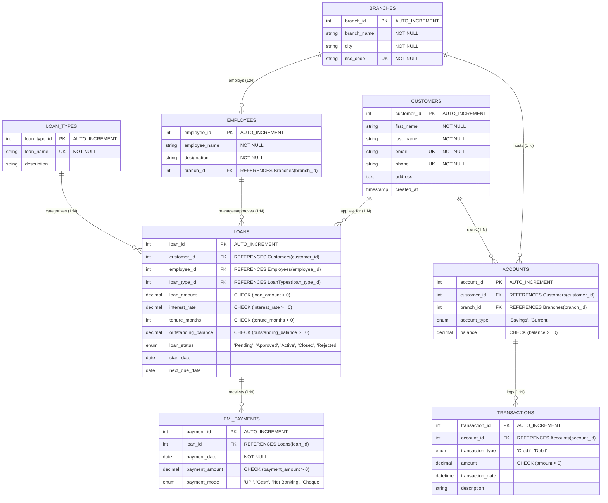

# 📐 Database Entity-Relationship (ER) Diagram & Schema Architecture

This document provides a comprehensive blueprint of the relational database model powering the **Banking & Loan Management System**.

---

## 📊 Relational Entity-Relationship Diagram

---

## 🔗 Table Relationships & Cardinalities

| Parent Entity | Child Entity | Relationship | FK Constraint & Action | Business Description |
| :--- | :--- | :---: | :--- | :--- |
| `Branches` | `Employees` | `1 : N` | `ON DELETE CASCADE` | A bank branch employs multiple bank staff and loan officers. |
| `Branches` | `Accounts` | `1 : N` | `ON DELETE CASCADE` | A branch hosts multiple customer deposit accounts. |
| `Customers` | `Accounts` | `1 : N` | `ON DELETE CASCADE` | A customer can hold multiple savings or current accounts. |
| `Customers` | `Loans` | `1 : N` | `ON DELETE CASCADE` | A customer can apply for and maintain multiple loan accounts. |
| `Employees` | `Loans` | `1 : N` | `ON DELETE CASCADE` | A loan officer oversees and manages multiple customer loans. |
| `LoanTypes` | `Loans` | `1 : N` | `ON DELETE CASCADE` | Loan types (Home, Personal, Vehicle, Business, Education) categorize loans. |
| `Loans` | `EMI_Payments` | `1 : N` | `ON DELETE CASCADE` | An active loan accumulates repayment records over its tenure. |
| `Accounts` | `Transactions` | `1 : N` | `ON DELETE CASCADE` | Each account logs a ledger of debit and credit transactions. |

---

## 🛡️ Key Constraints & Business Rules

1. **Non-Negative Balance Constraint (`CHECK balance >= 0`)**:
   - Customer account balance can never drop below zero.
2. **Positive Disbursal Constraints (`CHECK loan_amount > 0`)**:
   - Loan principal, EMI payment amounts, and transaction values must always be strictly positive.
3. **Automatic Outstanding Debt Adjustment**:
   - When an entry is inserted into `EMI_Payments`, database triggers automatically update `Loans.outstanding_balance` and change status to `Closed` upon full repayment.
4. **Referential Integrity Cascades**:
   - Primary key references maintain strict referential integrity (`ON DELETE CASCADE`).
