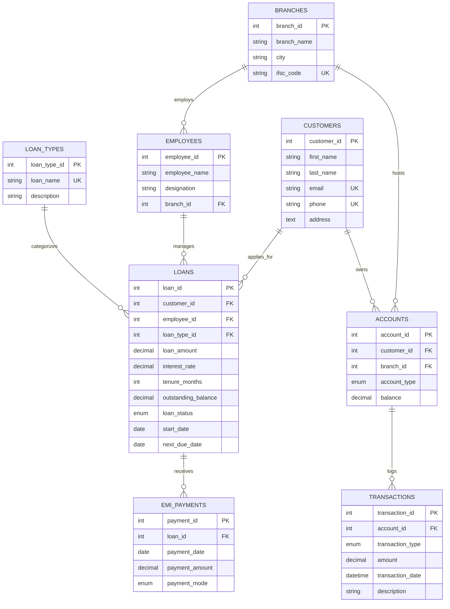

# 🏦 Banking & Loan Management System

[](https://www.mysql.com/)
[](https://en.wikipedia.org/wiki/SQL)
[](LICENSE)
[](https://github.com/Harshnikam04/Banking-Loan-Management-System)

A comprehensive, robust relational database system designed to handle core banking operations, customer account management, loan processing, EMI scheduling, and transaction tracking.

---

## 📌 Table of Contents

- [Overview](#-overview)
- [Key Features](#-key-features)
- [Database ER Diagram](#-database-er-diagram)
- [Database Schema](#-database-schema)
- [Repository Structure](#-repository-structure)
- [Getting Started & Installation](#-getting-started--installation)
- [Sample Queries & Analytical Reports](#-sample-queries--analytical-reports)
- [Future Enhancements](#-future-enhancements)
- [Author & License](#-author--license)

---

## 🎯 Overview

The **Banking & Loan Management System** models a modern retail bank's back-end database architecture. It maintains integrity across multiple branch networks, employee assignments, customer profiles, savings/current accounts, loan applications, interest rates, EMI repayments, and financial auditing logs.

This repository provides ready-to-deploy SQL scripts for database creation, schema definition with foreign key constraints, and sample data population.

---

## ✨ Key Features

- **Branch & Staff Management**: Track bank branches across cities and assign loan officers and managers to specific locations.
- **Customer Account Tracking**: Manage customer profiles and link them with multi-type accounts (`Savings`, `Current`) enforced with non-negative balance constraints.
- **Flexible Loan Processing**: Support multiple loan products (`Home Loan`, `Personal Loan`, `Vehicle Loan`, `Business Loan`) with dynamic interest rates, tenures, and status tracking (`Pending`, `Approved`, `Active`, `Closed`, `Rejected`).
- **EMI Repayment Records**: Log repayments across various payment channels (`UPI`, `Net Banking`, `Cash`, `Cheque`) linked directly to active loan accounts.
- **Transaction Auditing**: Record real-time credits and debits on accounts with timestamps and transaction descriptions.

---

## 📐 Database ER Diagram

Below is the conceptual Entity-Relationship (ER) model representing table relationships:



---

## 🗄️ Database Schema

The database consists of 8 core tables with full referential integrity (`FOREIGN KEY`), cascades, and data checks:

| Table Name | Description | Key Attributes / Constraints |
| :--- | :--- | :--- |
| `Branches` | Bank branch network details | `branch_id` (PK), Unique `ifsc_code` |
| `Employees` | Bank staff & loan officers | `employee_id` (PK), `branch_id` (FK) |
| `Customers` | Account holders & loan borrowers | `customer_id` (PK), Unique `email`, `phone` |
| `Accounts` | Customer savings & current accounts | `account_id` (PK), `CHECK (balance >= 0)` |
| `LoanTypes` | Available credit products | `loan_type_id` (PK), Unique `loan_name` |
| `Loans` | Disbursed loans & active balances | `loan_id` (PK), `loan_status` Enum, Constraints |
| `EMI_Payments` | Repayment history per loan | `payment_id` (PK), `loan_id` (FK), Payment Mode |
| `Transactions` | Detailed ledger of credits/debits | `transaction_id` (PK), `account_id` (FK), Timestamp |

---

## 📁 Repository Structure

```text
Banking-Loan-Management-System/
│
├── SQL/
│   ├── 01_create_database.sql   # Creates 'banking_system' database
│   ├── 02_create_tables.sql     # Builds all 8 tables & foreign key constraints
│   └── 03_insert_data.sql       # Inserts initial sample benchmark data
│
├── ER_Diagram/                  # ER diagrams & relational models
├── Reports/                     # Analytical SQL query scripts & reports
├── Screenshots/                 # Execution screenshots & database outputs
│
└── README.md                    # Project documentation
```

---

## 🚀 Getting Started & Installation

### Prerequisites

- **Database Server**: [MySQL Server 8.0+](https://dev.mysql.com/downloads/mysql/) or [MariaDB](https://mariadb.org/)
- **GUI Tool (Optional)**: [MySQL Workbench](https://www.mysql.com/products/workbench/), DBeaver, or phpMyAdmin

### Execution Order

Run the scripts in sequential order via MySQL CLI or Workbench:

```bash
# 1. Connect to MySQL Server
mysql -u root -p

# 2. Run Database Creation Script
source SQL/01_create_database.sql

# 3. Create Tables and Relationships
source SQL/02_create_tables.sql

# 4. Populate Database with Sample Data
source SQL/03_insert_data.sql
```

---

## 📊 Sample Queries & Analytical Reports

### 1. View Active Loans with Customer Details

```sql
SELECT 
    l.loan_id,
    CONCAT(c.first_name, ' ', c.last_name) AS customer_name,
    lt.loan_name,
    l.loan_amount,
    l.outstanding_balance,
    l.loan_status,
    e.employee_name AS officer_in_charge
FROM Loans l
JOIN Customers c ON l.customer_id = c.customer_id
JOIN LoanTypes lt ON l.loan_type_id = lt.loan_type_id
JOIN Employees e ON l.employee_id = e.employee_id
WHERE l.loan_status = 'Active';
```

### 2. Branch-wise Account Balance Summary

```sql
SELECT 
    b.branch_name,
    b.city,
    COUNT(a.account_id) AS total_accounts,
    SUM(a.balance) AS total_branch_balance
FROM Branches b
LEFT JOIN Accounts a ON b.branch_id = a.branch_id
GROUP BY b.branch_id, b.branch_name, b.city;
```

---

## 🔮 Future Enhancements

- [ ] **Stored Procedures**: Automate monthly interest calculations and overdue late fee assessments.
- [ ] **Triggers**: Auto-update `outstanding_balance` on `Loans` whenever an entry is inserted into `EMI_Payments`.
- [ ] **REST API Integration**: Node.js/Python FastAPI backend to expose banking endpoints.

---

## 👤 Author & License

- **Repository**: [Harshnikam04/Banking-Loan-Management-System](https://github.com/Harshnikam04/Banking-Loan-Management-System)
- **License**: Released under the [MIT License](LICENSE).
