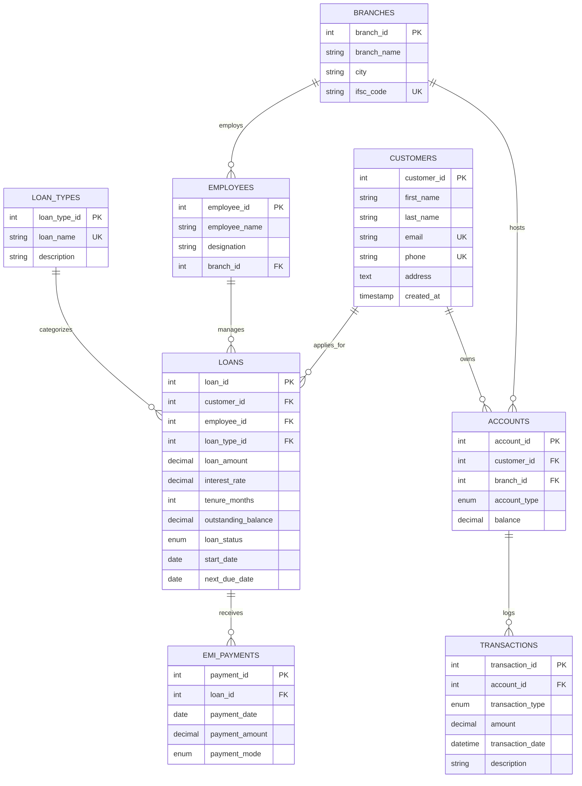

# 🏦 Banking & Loan Management System

[](https://www.mysql.com/)
[](https://en.wikipedia.org/wiki/SQL)
[](https://reactjs.org/)
[](LICENSE)
[](https://github.com/Harshnikam04/Banking-Loan-Management-System)

A comprehensive, robust enterprise database architecture and interactive web management portal designed to handle core retail banking operations, customer accounts, loan disbursals, EMI schedules, transaction auditing, stored procedures, automated database triggers, and business intelligence reports.

---

## 📌 Table of Contents

- [Overview](#-overview)
- [Key Features](#-key-features)
- [Database ER Diagram & Architecture](#-database-er-diagram--architecture)
- [Database Schema & Objects](#-database-schema--objects)
- [Repository Structure](#-repository-structure)
- [Getting Started & Installation](#-getting-started--installation)
  - [Database Deployment (MySQL)](#1-database-deployment-mysql)
  - [Interactive Web Portal (Vite + React)](#2-interactive-web-portal-vite--react)
- [Stored Procedures & Automated Triggers](#-stored-procedures--automated-triggers)
- [Analytical Reports & Business Intelligence](#-analytical-reports--business-intelligence)
- [Author & License](#-author--license)

---

## 🎯 Overview

The **Banking & Loan Management System** models a modern retail bank back-end architecture and interactive enterprise management dashboard. It maintains data integrity across multiple branch networks, employee assignments, customer profiles, deposit accounts (`Savings`, `Current`), loan applications, interest rates, EMI repayments, and audit logs.

This repository provides ready-to-deploy SQL scripts for database creation, table constraints, bench data generation, stored procedures, database triggers, analytical views, modular business reports, and a full-stack interactive web application.

---

## ✨ Key Features

- **Branch & Staff Management**: Track bank branches across cities and assign loan officers and managers to specific locations.
- **Customer Deposit Tracking**: Manage customer profiles and link them with multi-type accounts (`Savings`, `Current`) enforced with non-negative balance constraints (`CHECK balance >= 0`).
- **Flexible Loan Processing**: Support multiple credit products (`Home Loan`, `Personal Loan`, `Vehicle Loan`, `Business Loan`, `Education Loan`) with dynamic interest rates, tenures, and status tracking (`Pending`, `Approved`, `Active`, `Closed`, `Rejected`).
- **Automated EMI Repayments**: Log repayments across various payment channels (`UPI`, `Net Banking`, `Cash`, `Cheque`) with auto-recalculation of `outstanding_balance` and auto-closing upon full settlement.
- **Stored Procedures & Triggers**:
  - `sp_ProcessEMIPayment`: Process EMI payments, adjust balances, auto-close zero-balance loans.
  - `sp_DisburseLoan`: Approve and disburse loan amounts directly into customer accounts.
  - `sp_CalculateMonthlyInterest`: Calculate monthly interest accrued across active loan portfolios.
  - `sp_AssessLateFees`: Assess late fees on overdue loans.
  - `trg_after_emi_payment_update_balance`: Trigger auto-deducting EMI payments from outstanding loan balance.
  - `trg_prevent_insufficient_funds`: Overdraft prevention trigger raising SQLSTATE exception on negative account balance.
- **Analytical Views & Indexes**: Views for active loans, branch metrics, NPAs (Non-Performing Assets), customer portfolios, and B-tree indexes for fast queries.
- **Interactive Web Portal**: Built with Vite + React featuring live dashboard charts, customer 360 drawers, EMI calculator, stored procedure execution runner, and SQL query execution suite with CSV export.

---

## 📐 Database ER Diagram & Architecture

Below is the Entity-Relationship (ER) model representing table relationships:



*For detailed schema definitions and foreign key constraints, view [ER_Diagram/README.md](file:///c:/Users/harsh/Desktop/NeBanking-Loan-Management-Systemw%20folder/ER_Diagram/README.md).*

---

## 🗄️ Database Schema & Objects

The database consists of 8 core relational tables with foreign key constraints, cascading actions, check constraints, stored procedures, triggers, and views:

| Table / Object | Description | Key Attributes / Constraints |
| :--- | :--- | :--- |
| `Branches` | Bank branch network details | `branch_id` (PK), Unique `ifsc_code` |
| `Employees` | Bank staff & loan officers | `employee_id` (PK), `branch_id` (FK) |
| `Customers` | Account holders & borrowers | `customer_id` (PK), Unique `email`, `phone` |
| `Accounts` | Customer savings & current accounts | `account_id` (PK), `CHECK (balance >= 0)` |
| `LoanTypes` | Available credit products | `loan_type_id` (PK), Unique `loan_name` |
| `Loans` | Disbursed loans & active balances | `loan_id` (PK), `loan_status` Enum, Constraints |
| `EMI_Payments` | Repayment history per loan | `payment_id` (PK), `loan_id` (FK), Payment Mode |
| `Transactions` | Ledger of credits and debits | `transaction_id` (PK), `account_id` (FK), Timestamp |

---

## 📁 Repository Structure

```text
Banking-Loan-Management-System/
│
├── SQL/
│   ├── 01_create_database.sql       # Creates 'banking_system' database
│   ├── 02_create_tables.sql         # Builds all 8 tables & foreign key constraints
│   ├── 03_insert_data.sql           # Benchmark sample data insertion
│   ├── 04_queries.sql               # 41 business analytical SQL queries
│   ├── 05_generate_data.sql         # Large dataset generator script (500+ records)
│   ├── 06_stored_procedures.sql     # Stored procedures (EMI, Interest, Disbursal)
│   ├── 07_triggers.sql              # Automated balance triggers & overdraft checks
│   └── 08_views_and_indexes.sql     # Database analytical views & B-tree indexes
│
├── Reports/                         # Analytical SQL query report scripts
│   ├── 01_executive_summary.sql     # High-level financial KPIs & summary metrics
│   ├── 02_branch_performance.sql    # Branch deposit & loan officer leaderboard
│   ├── 03_loan_portfolio_and_npa.sql# Non-performing asset (NPA) & risk analysis
│   └── 04_customer_360.sql          # Customer 360 portfolio & deposit analysis
│
├── ER_Diagram/
│   └── README.md                    # ER diagrams, table schemas & relationship matrix
│
├── web/                             # Interactive Web Application Dashboard (Vite + React)
│   ├── src/                         # React components, CSS design system & DB engine
│   ├── index.html                   # Entry HTML template
│   ├── package.json                 # Web dependencies
│   └── vite.config.js               # Vite build configuration
│
└── README.md                        # Project documentation
```

---

## 🚀 Getting Started & Installation

### 1. Database Deployment (MySQL)

#### Prerequisites
- **Database Server**: [MySQL Server 8.0+](https://dev.mysql.com/downloads/mysql/) or MariaDB
- **Tools**: MySQL CLI, MySQL Workbench, DBeaver, or phpMyAdmin

#### Sequential Script Execution
Execute the SQL scripts sequentially to initialize the schema, populate data, deploy procedures, triggers, views, and reports:

```bash
# Connect to MySQL CLI
mysql -u root -p

# Execute SQL scripts in order:
source SQL/01_create_database.sql;
source SQL/02_create_tables.sql;
source SQL/03_insert_data.sql;
source SQL/04_queries.sql;
source SQL/05_generate_data.sql;
source SQL/06_stored_procedures.sql;
source SQL/07_triggers.sql;
source SQL/08_views_and_indexes.sql;
```

---

### 2. Interactive Web Portal (Vite + React)

The web dashboard allows interactive visual management of branches, customers, loans, EMI processing, running stored procedures, and viewing reports directly in your browser.

#### Prerequisites
- **Node.js**: v18.0.0 or higher

#### Quick Start
```bash
# Navigate to web application directory
cd web

# Install dependencies
npm install

# Start local development server
npm run dev
```

Open `http://localhost:3000` in your web browser to access the application dashboard.

---

## ⚙️ Stored Procedures & Automated Triggers

| Object Name | Type | Description |
| :--- | :---: | :--- |
| `sp_ProcessEMIPayment` | Stored Procedure | Processes EMI payments, updates `outstanding_balance`, auto-closes loan when balance reaches zero. |
| `sp_DisburseLoan` | Stored Procedure | Creates loan contract, credits loan amount directly to customer account, logs transaction. |
| `sp_CalculateMonthlyInterest` | Stored Procedure | Calculates accrued monthly interest for all active loans. |
| `sp_AssessLateFees` | Stored Procedure | Identifies overdue loans and assesses late fee penalty. |
| `trg_after_emi_payment_update_balance` | Trigger | Auto-deducts EMI payment amount from loan's outstanding balance after payment insertion. |
| `trg_prevent_insufficient_funds` | Trigger | Blocks account balance updates that result in a negative balance with SQLSTATE '45000'. |

---

## 📊 Analytical Reports & Business Intelligence

The `Reports/` directory includes modular SQL scripts providing instant business intelligence:

1. **Executive Financial Summary** ([01_executive_summary.sql](file:///c:/Users/harsh/Desktop/NeBanking-Loan-Management-Systemw%20folder/Reports/01_executive_summary.sql)): Total deposits, loan capital disbursed, active debt, and loan-to-deposit ratio.
2. **Branch Performance & Leaderboard** ([02_branch_performance.sql](file:///c:/Users/harsh/Desktop/NeBanking-Loan-Management-Systemw%20folder/Reports/02_branch_performance.sql)): Branch deposit volume, total accounts hosted, and loan officer productivity ranking.
3. **Loan Risk & NPA Breakdown** ([03_loan_portfolio_and_npa.sql](file:///c:/Users/harsh/Desktop/NeBanking-Loan-Management-Systemw%20folder/Reports/03_loan_portfolio_and_npa.sql)): Overdue loans past due date, SMA/NPA risk classification, and payment mode stats.
4. **Customer 360 View** ([04_customer_360.sql](file:///c:/Users/harsh/Desktop/NeBanking-Loan-Management-Systemw%20folder/Reports/04_customer_360.sql)): Consolidated profile of deposit balances vs active debt liabilities per customer.

---

## 👤 Author & License

- **Repository**: [Harshnikam04/Banking-Loan-Management-System](https://github.com/Harshnikam04/Banking-Loan-Management-System)
- **License**: Released under the [MIT License](LICENSE).
